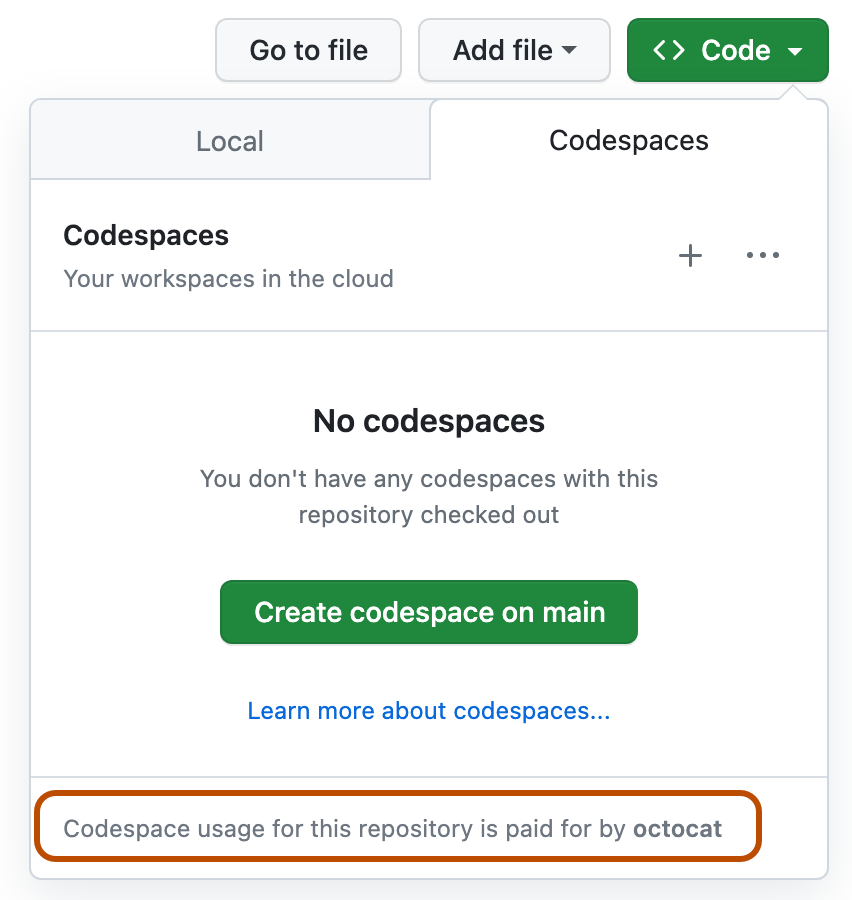

# yt-remote-downloader

## 2 Options

1. [Codespaces (No Fork)](#codespaces-no-fork)
2. [GitHub Actions (Fork Required)](#github-actions-run)

<a id="codespaces-no-fork"></a>

## 🚀 Option 1: GitHub Codespaces (No Fork)

### Open the Repository in GitHub Codespaces

1. Go to the repository on GitHub  
2. Click the green **Code** button  
3. Switch to the **Codespaces** tab  
4. Click **+ (Create codespace on main)**  



Or open an existing Codespace if one is already available.

---

### Working in VS Code

Once the Codespace is ready:
- VS Code will open (in your browser or desktop)
- Open a terminal inside the Codespace

---

### Download Videos from YouTube

#### Install `yt-dlp`:
```bash
pip install yt-dlp

# Download a video:

yt-dlp \
  --cookies cookies.txt \
  --remote-components ejs:github \
  --js-runtimes node \
  --extractor-args "youtube:player_client=ios,web,mweb" \
  -f "b" \
  "https://www.youtube.com/watch?v=..." # **Your Link**
```

`cookies.txt` is optional and should never be committed to Git.

---

### Download the File to Your Computer

1. Locate the downloaded file in the VS Code file explorer
2. Right-click the file
3. Click **Download**

---

<a id="github-actions-run"></a>

## ⚙️ Option 2: GitHub Actions (Fork Required)

You can run a manual workflow in GitHub and download the result directly from **Artifacts**.

### Workflow file

`.github/workflows/download-from-url.yml`

### How to run

1. Create a **fork** first and work from your fork.
2. Open your repository on GitHub.
3. Go to the **Actions** tab.
4. Select **Download from URL**.
5. Click **Run workflow**.
6. Fill in:
   - `url` (required): the video/page URL you want to download
   - `format` (optional): yt-dlp format selector (default is `b`)
   - `playlist_mode` (optional):
     - `auto` (default): let yt-dlp detect automatically
     - `single`: force single item only
     - `playlist`: force full playlist download
7. Click **Run workflow** to start.

### How to download the result

1. Open the completed workflow run
2. Scroll to **Artifacts**
3. Download `downloaded-file-<run_number>`
4. Extract the zip to get your downloaded file(s)

### Notes

- Cookies are optional. Many public videos will download without cookies.
- Some videos (age-restricted/private/rate-limited) may require cookies.
- If you see `Sign in to confirm you're not a bot`, add cookies secret and re-run.
- For shared usage, each user should run from their own fork and keep their own cookies secret (see [Add your own cookies safely (optional)](#add-your-own-cookies-safely-optional)).
- Files are uploaded from the `downloads/` folder.
- Artifact retention is set to 7 days.

### Add your own cookies safely (optional)

1. In GitHub, open **Settings** -> **Secrets and variables** -> **Actions**
2. Click **New repository secret**
3. Use one of these names:
   - `YTDLP_COOKIES`: paste full `cookies.txt` content (Netscape format)
   - `YTDLP_COOKIES_B64`: paste base64 of the same `cookies.txt` content
4. Save

The workflow will automatically use these secrets if they exist (`YTDLP_COOKIES_B64` is preferred when both exist).

# GitHub Codespaces + GUI Browser Setup

## 1. Open a new Codespace

Open your repository in GitHub Codespaces.

---

## 2. Install Desktop + noVNC

Run in the VS Code terminal:

```bash
sudo apt-get update

sudo apt-get install -y \
xfce4 xfce4-goodies \
novnc websockify \
x11vnc xvfb \
dbus-x11 \
unzip wget
```

---

## 3. Download Chromium

Run:

```bash
wget "https://download-chromium.appspot.com/dl/Linux_x64?type=snapshots" -O chromium.zip

unzip chromium.zip

chmod +x chrome-linux/chrome
```

---

## 4. Create VNC Password

Run:

```bash
mkdir -p ~/.vnc

x11vnc -storepasswd
```

Choose a password.

---

## 5. Start Desktop Environment

Run:

```bash
Xvfb :1 -screen 0 1920x1080x24 &
export DISPLAY=:1

dbus-launch startxfce4 &
```

---

## 6. Start VNC Server

Run:

```bash
x11vnc -display :1 -forever -usepw -rfbport 5900 &
```

---

## 7. Start noVNC Web Client

Run:

```bash
websockify --web=/usr/share/novnc/ 6080 localhost:5900
```

---

## 8. Open the Desktop

In VS Code:

1. Open the **Ports** tab
2. Find port `6080`
3. Click **Open in Browser**

Open:

```txt
http://localhost:6080/vnc.html
```

Press:

```txt
Connect
```

Enter your VNC password.

You should now see a full Linux desktop running inside GitHub Codespaces.

---

## 9. Launch Chromium GUI Browser

Inside the Desktop terminal:

```bash
cd /workspaces/YOUR_PROJECT_NAME
```

Run Chromium:

```bash
./chrome-linux/chrome \
  --no-sandbox \
  --disable-dev-shm-usage \
  --disable-gpu \
  --user-data-dir=/tmp/chrome-vnc
```

---

## Notes

### If the browser crashes

Run with the exact flags above.

The important flag is:

```bash
--disable-dev-shm-usage
```

---

## Result

You now have:

* Full GUI desktop
* Chromium browser
* Browser traffic running through the GitHub Codespace server
* Remote Linux environment accessible from VS Code
